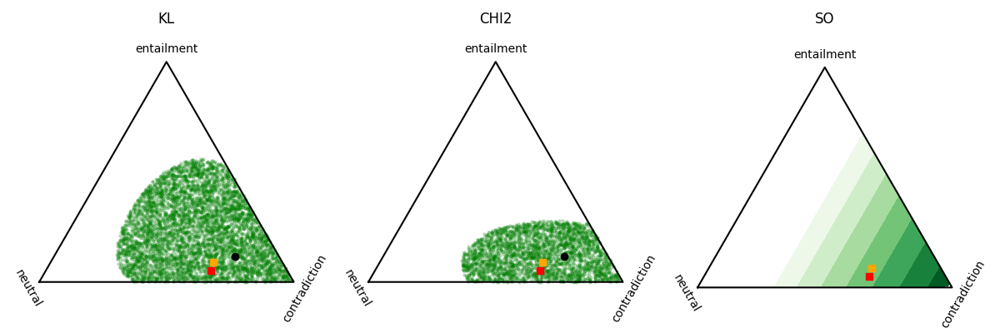

# ConfCredalPredictor

Credal set prediction framework that combines conformal calibration and uncertainty-aware NLI modeling in PyTorch.

---

## Features

- ChaosNLI (SNLI/MNLI) loaders and DeBERTa CLS-embedding pipeline
- Two-headed MLP predictor with shared backbone:
  - First-order head outputs class logits
  - Second-order head outputs Dirichlet concentration parameters
- Conformal calibration using KL and χ² divergences for first-order prediction
- Second-order conformal predictor calibrated via relative-likelihood distance
- Sampling-based approximation of conformal credal sets
- Simplex visualization (equilateral triangle) for both first- and second-order distributions

---

## Project Structure

```
ConfCredalPredictor/
│
├── data/
│   ├── chaosNLI_snli.jsonl                     # SNLI human label annotations
│   ├── chaosNLI_snli_embeddings.pt             # SNLI embeddings
│   ├── chaosNLI_snli_embeddings_noisy.pt       # Noisy SNLI distributions (resampled)
│   ├── chaosNLI_mnli_m.jsonl                   # MNLI-matched human label annotations
│   ├── chaosNLI_mnli_m_embeddings.pt           # MNLI-matched embeddings
│   └── chaosNLI_mnli_m_embeddings_noisy.pt     # Noisy MNLI-matched distributions (resampled)
│
├── src/
│   ├── cp.py           # Conformal credal predictor (KL, CHI2, SO)
│   ├── dataset.py      # Loading and concatenating embeddings and distributions, splitting and DataLoader building
│   ├── embedding.py    # CLS embedding extraction via DeBERTa encoding for premise–hypothesis pairs
│   ├── evaluation.py   # Evaluation metrics (coverage, efficiency)
│   ├── model.py        # Shared backbone + first- and second-order predictor heads
│   ├── noise.py        # Multinomial resampling to create noisy distributions
│   └── plot.py         # Simplex visualization utilities
│
├── ex_res.png
├── main.py             # Multi-seed training and calibration, evaluation and visualization
└── README.md
```

---

## Setup

### 1) Clone & environment
```bash
git clone https://github.com/<your-username>/ConfCredalPredictor.git
cd ConfCredalPredictor
python -m venv .venv
source .venv/bin/activate # (Windows: .venv\Scripts\activate)
```

### 2) Install dependencies
Create `requirements.txt` as needed, then:
```bash
pip install -r requirements.txt
```

**requirements.txt**
```text
torch
transformers
numpy
pandas
scipy
matplotlib
tqdm
```

---

## Train, Calibrate, Evaluate & Plot

Run the full pipeline (using the included SNLI+MNLI data):
```bash
python main.py
```

You should see training loss decreasing and calibrated thresholds printed, followed by average coverage and efficiency values after the final seed:
```
Epoch 09: Total Loss = 0.0093 FO Loss = 0.2631, SO Loss = -0.8459
Calibrated threshold: 0.5255 (first-order, KL)
Calibrated threshold: 1.1180 (first-order, CHI2)
Calibrated threshold: 0.3812 (second-order)
FO - KL: (0.9348, 0.6114), FO - CHI2: (0.9256, 0.5546), SO: (0.9172, 0.6836)
```

A plot window will display three adjacent simplexes:
- **Green region**:
  - For **first-order** (KL, CHI2) → conformalized credal set (distributions with nonconformity < threshold)
  - For **second-order** (SO) → likelihood heatmap under the Dir distribution (lighter = less likely, darker = more probable)
- **Black dot** → model's first-order prediction
- **Orange square** → true human label distribution
- **Red square** → noisy (annotator-sampled) distribution used for supervision

---

## Example Result

Below is an example result from the trained model:

<p align = "center">
  
</p>

---

## Key Differences

- **Alternative distance function** – we evaluate two first-order nonconformity functions, KL (for comparability with the paper) and χ² divergences, and χ² achieved better empirical performance.
- **Sampling-based calibration** – instead of the paper's grid search over the simplex, we employ random sampling of probability distributions, which offers faster approximation of the credal set.

---

## Acknowledgments

Inspired by the paper *Conformalized Credal Set Predictors* (NeurIPS 2024).
